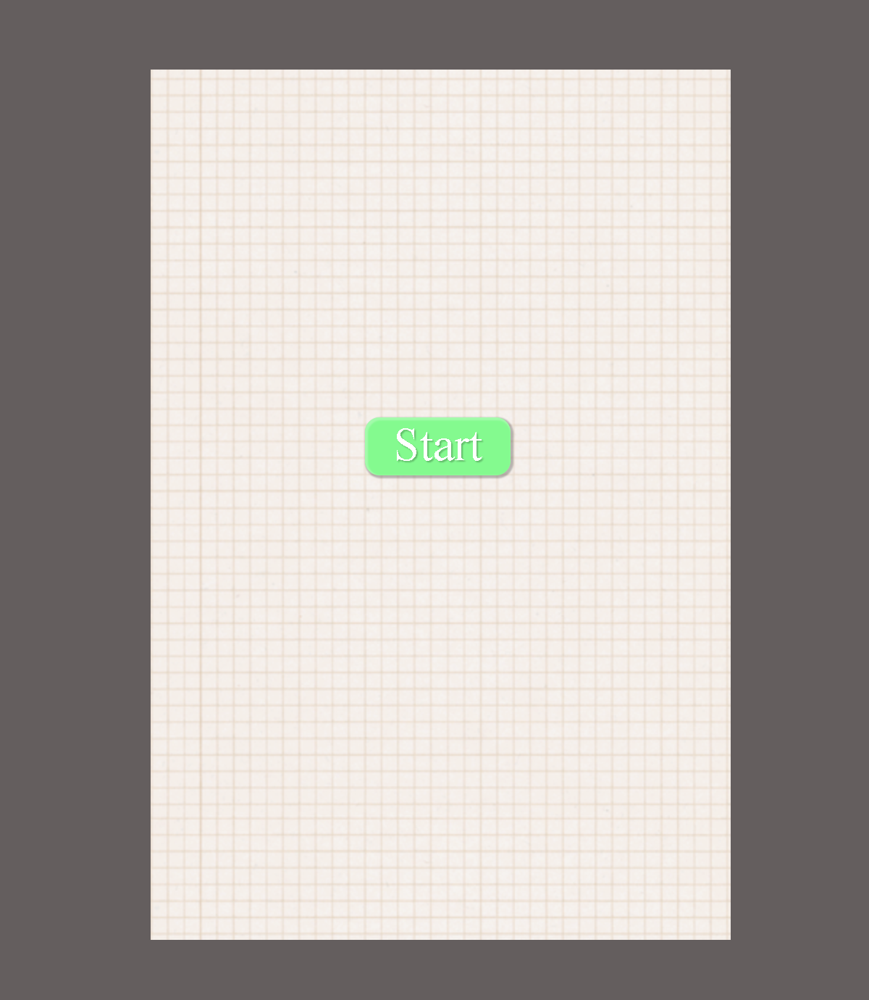
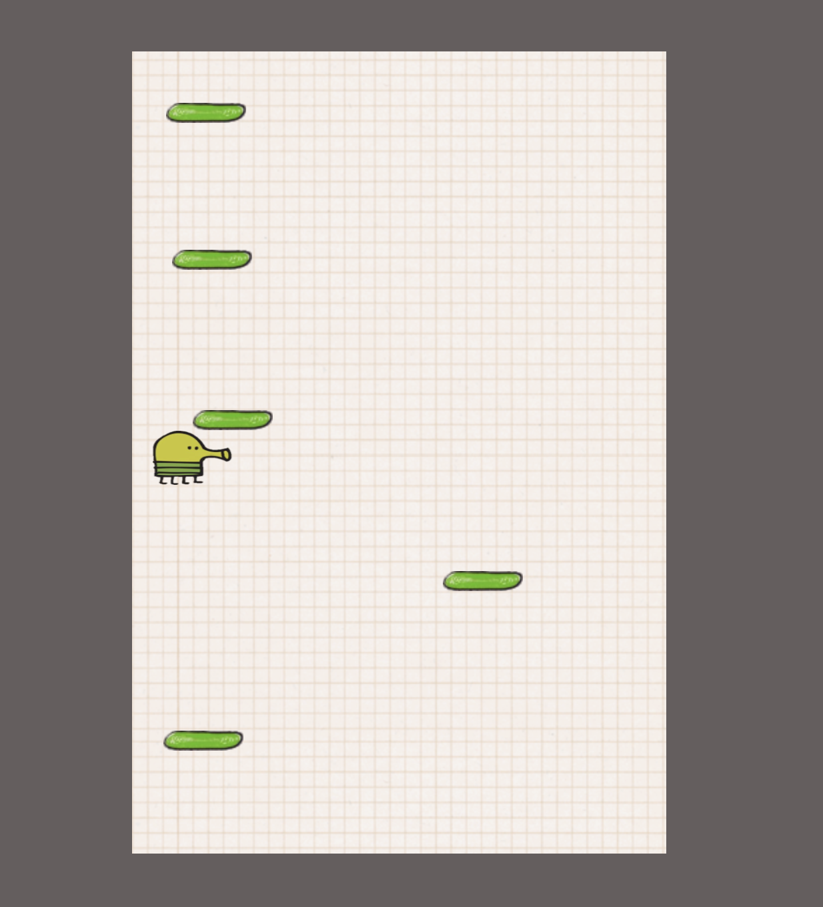
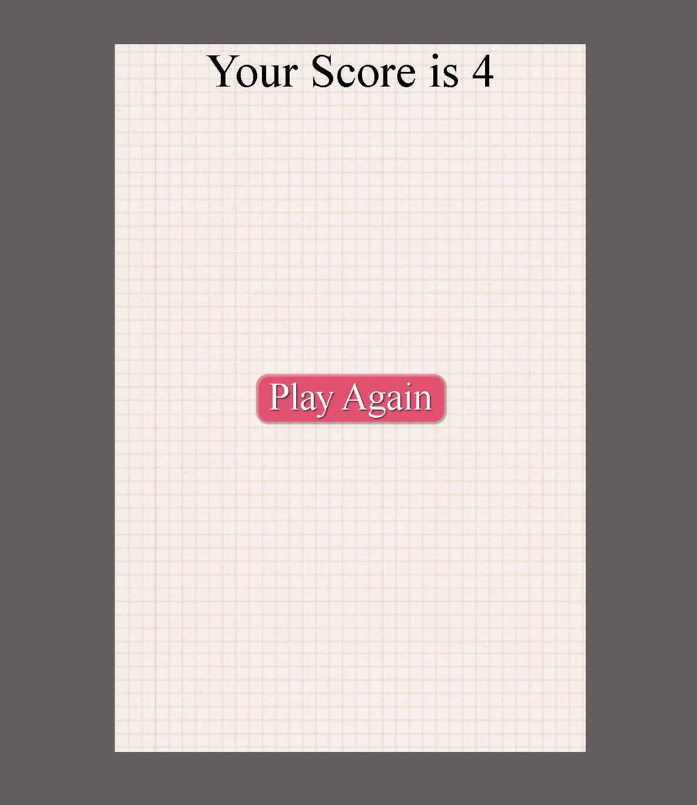

# Doddle_Jump
The Doodle Jump is a game where players control a character ("Doddler") to jump between platforms and achieve the highest score possible. The game features dynamic platforms that move downwards, requiring the player to keep jumping to stay on screen. It includes user controls for moving left, right, and jumping, and displays a "Play Again" button upon game over. JavaScript manages game logic and user interactions, while CSS handles the visual styling and layout. The game is initiated by clicking a "Start" button and can be restarted with the "Play Again" button.

